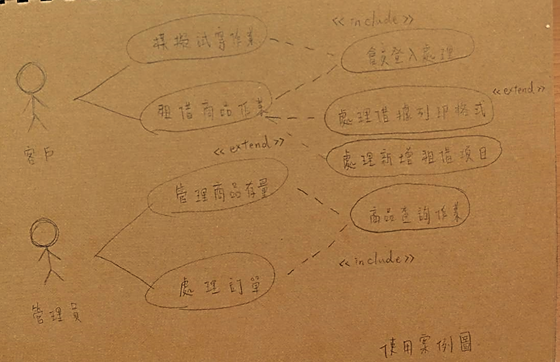

# 萬緯萱 :squirrel:

## 學號：0624029

### 資管系三甲

#### 專案名稱：

###### 小組成員：

* `0624029 萬緯萱`

* 0624035 謝佩容

* 0624047 蔡昕晏

* 0624099 林彥葶

###### My First Assignment


```
* 0624029 萬緯萱

* 0624035 謝佩容

* 0624047 蔡昕晏

* 0624099 林彥葶
```

[高科大](https://www.nkust.edu.tw)

|Center Aligned||Center Aligned||Center Aligned|
|:------||:------:||------:|
|12||123||1234|

1.	專題題目
身「麗」其「鏡」-AR衣櫃
2.	文字敘述專題需求
在租、賣衣平台內附加AR技術，製作可租、買衣又具模擬身材功能的租衣平台，讓使用者可以更具體知道穿在自己身上的效果，且可透過其他使用者分享的實穿照，更了解實穿效果，進而決定是否消費。
3.	寫出專題之功能性需求與非功能性需求
*功能性需求
模擬身材、試衣
使用者介面
珍藏喜愛項目功能
*非功能性
操作性:使用者能將滿意的衣物暫放珍藏
效能:模擬衣物上身的時間不宜超過2秒鐘
安全:僅有客戶跟管理員可以看見珍藏項目
隱私權:遵守個人資料使用規範
4.	畫出 使用案例圖 (use case diagram)





5.	由上而下 排出 使用案例的重要性

>1.模擬試穿作業

>2.租借作業

>3.處理訂單系統


6.	寫出 其中的 至少三個使用案例

模擬試穿作業

>1.客戶挑選滿意衣物

>2.將挑選衣物放進珍藏 

>3.調整身材比例

>>3.1經模擬，數據發現使用者將會穿不下此衣物

>>3.2建議使用者點選其他衣物或給予適合的衣物

>>3.3使用者重新挑選新的衣物

>4.打開介面點選進入模擬試穿

>5.模擬試穿完成

租借作業

>1從珍藏中選出確定租借的衣物

>2進入租借程序

>>2.1還有到期衣服尚未歸還不得租借

>>2.2歸還衣物完畢

>3選擇租借期間

>4確定租借

處理訂單系統

>1.收到客戶訂單需求

>2.確認訂單資料
>>2.1訂單有誤，通知客戶並取消訂單

>3.通知物流

>4.完成訂單處理


7. 寫出 user story 

>(1)我是一個使用者，我希望試穿的時候，系統可以告訴我衣物尺寸適不適合我，及有沒有推薦我身材的衣物款式，並且當我選取喜歡的衣物時，可以進行模擬試穿。

>(2)我是一個使用者，我希望當我要租借衣物時，可以先通知我是否有衣物未歸還，並且可以選擇自己想要的租借的期間。

>(3)我是一個管理者，我希望當我收到客戶訂單時，訂單有誤時，可以先通知客戶，並取消訂單，若無誤直接通知物流發貨。


