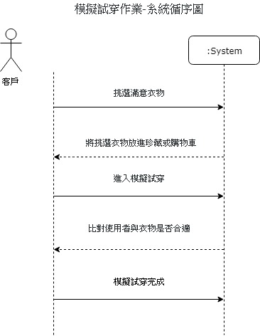

# 萬緯萱 :squirrel:

## 學號：0624029

### 資管系三甲

#### 專案名稱：

###### 小組成員：

* `0624029 萬緯萱`

* 0624035 謝佩容

* 0624047 蔡昕晏

* 0624099 林彥葶

###### My First Assignment


```
* 0624029 萬緯萱

* 0624035 謝佩容

* 0624047 蔡昕晏

* 0624099 林彥葶
```

[高科大](https://www.nkust.edu.tw)

|Center Aligned|Center Aligned|Center Aligned|
|:------|:------:|------:|
|12|123|1234|

### 1.	專題題目
身「麗」其「鏡」-AR衣櫃
### 2.	文字敘述專題需求
在租、賣衣平台內附加AR技術，製作可租、買衣又具模擬身材功能的租衣平台，讓使用者可以更具體知道穿在自己身上的效果，且可透過其他使用者分享的實穿照，更了解實穿效果，進而決定是否消費。

### 3.	寫出專題之功能性需求與非功能性需求
#### 功能性需求

>>模擬身材、試衣

>>使用者介面

>>珍藏喜愛項目功能

#### 非功能性需求

>>操作性:使用者能將滿意的衣物暫放珍藏

>>效能:模擬衣物上身的時間不宜超過2秒鐘

>>安全:僅有客戶跟管理員可以看見珍藏項目

>>隱私權:遵守個人資料使用規範

### 4.	畫出 使用案例圖 (use case diagram)


### 5.	由上而下 排出 使用案例的重要性

>1.模擬試穿作業

>2.租借作業

>3.處理訂單

>4.管理商品存貨

>5.商品查詢

>6.會員登入處理

>7.增減租借衣物

>8.處理發票列印格式

### 6.	寫出 其中的 至少三個使用案例

#### 模擬試穿作業

>1.客戶挑選滿意衣物

>2.將挑選衣物放進珍藏 

>3.點選模擬試穿功能

>4.比對客戶與衣物是否合適

>>4.1數據發現客戶與衣物不合適

>>4.2建議客戶點選其他衣物或給予適合的衣物

>>4.3客戶重新挑選新的衣物

>5.模擬試穿完成

替代路徑
>3.1客戶到實體店面試穿衣物

#### 租借作業

>1.從珍藏中選出確定租借的衣物

>2.進入租借程序

>>2.1還有到期衣服尚未歸還不得租借

>>2.2歸還衣物完畢

>3.確定租借

>4.完成訂單

#### 處理訂單

>1.收到客戶訂單需求

>2.確認訂單資料
>>2.1訂單有誤，通知客戶並取消訂單

>3.訂單成立

>4.通知物流

>5.完成訂單處理


### 7. 寫出 user story 

>(1)我是一個客戶，我希望試穿的時候，系統可以告訴我衣物尺寸適不適合我，及有沒有推薦我身材的衣物款式，並且當我選取喜歡的衣物時，可以進行模擬試穿。

>(2)我是一個客戶，我希望當我要租借衣物時，可以先通知我是否有衣物未歸還，並且可以選擇自己想要的租借的期間。

>(3)我是一個管理員，我希望當顧客租借、歸還衣物、進貨或退貨的時候，系統可以進行存量的增減。

>(4)我是一個管理員，我希望當我收到客戶訂單時，訂單有誤時，可以先通知客戶，並取消訂單，若無誤直接通知物流發貨。

### 8.  初步類別圖 

## 模擬試穿作業


## 租借作業


### 9.  系統循序圖 



